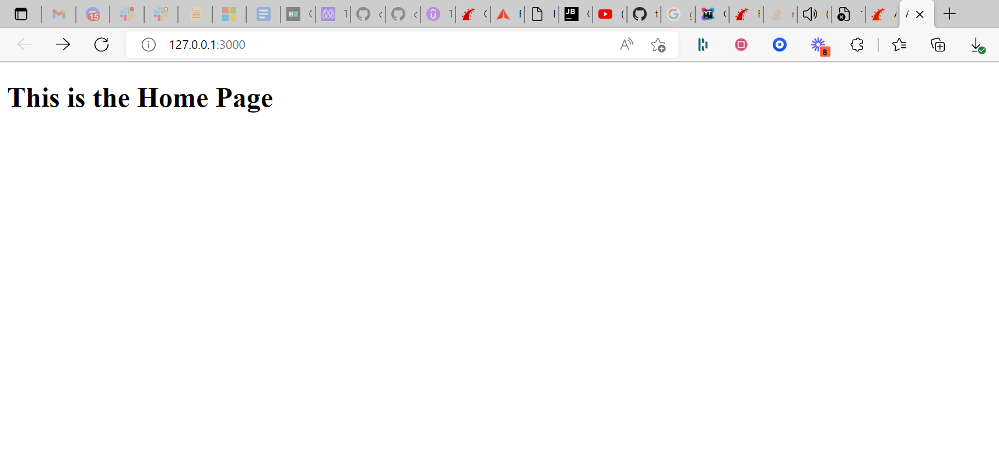

# Alpha Blog

> One paragraph statement about the project.



Additional description about the project and its features.

## Built With

- Ruby
- Rails
- Rubocop, stylelint, heroku actions


## Live Demo

[Live Demo Link](https://warm-reaches-36729.herokuapp.com/)


## Getting Started

To get a local copy up and running follow these simple example steps.
## 🛠 Installation & Set Up

1. Install Gems

   ```sh
   bundle install
   ```

2. Start the development server

   ```sh
    rails s
   ```


### Prerequisites
Basic knowledge of Ruby on Rails

### Setup

### Install
The following tools help make easier to work with sample code.

- [git](https://git-scm.com/downloads): A tool for managing source code
- [Visual Studio Code](https://code.visualstudio.com/): A source code editor
- [NVM](https://github.com/nvm-sh/nvm)
- [Ruby](https://www.ruby-lang.org/en/documentation/installation/)
- [Rails](https://www.digitalocean.com/community/tutorials/how-to-install-ruby-on-rails-with-rbenv-on-ubuntu-20-04)

## Authors

👤 **Temitope Ogunleye**

- GitHub: [@topeogunleye](https://github.com/topeogunleye)
- Twitter: [@tope_leye](https://twitter.com/tope_leye)
- LinkedIn: [ogunleye](https://linkedin.com/in/ogunleye)

## 🤝 Contributing

Contributions, issues, and feature requests are welcome!

Feel free to check the [issues page](https://github.com/topeogunleye/recipe-app/issues).

## Show your support

Give a ⭐️ if you like this project!

## Acknowledgments

- Hat tip to anyone whose code was used
- Inspiration
- etc

## 📝 License

This project is [MIT](./MIT.md) licensed.
